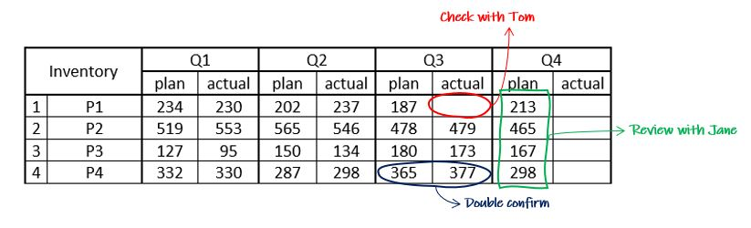
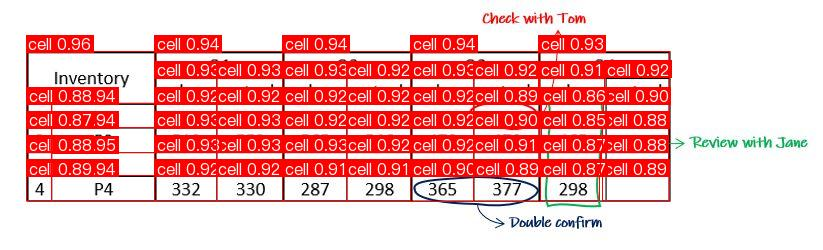

# Table cell counter

This repository contains a functionality to count the number of cells in a particular table. Just point to the image path and it will give the number of cells in that table.


## Techniques Used

Two approaches are showcased here and depending on your availability of resource/preferrence you can select either.

### Non-AI based approach
The first approach is a lightweight one where we do not use any Machine/Deep Learning models. The cells are counted using only Python OpenCV.

It utilizes image processing techniques along with performing a set of morphological operations on the image to detect and count the cells. 

### AI based approach
This second approach use a Deep Learning model to count the number of cells. Alhough this requires more computational resource but it is mouch more accurate and robust as it can handle both borderless and bordered tables.

This technique uses a Deep Learning model to detect and count the cells. This apporach is more robust and accurat than compared to the first one but requires heavy computational resources (i.e. GPU).
## Run Locally

Make sure you have python 3.11 or later installed.

Clone the project

```bash
  git clone https://link-to-project
```

Go to the project directory

```bash
  cd my-project
```

Create a new python virtual environment

```bash
  python -m venv <env_name>
```

Activate the created python virtual environment

```bash
  <env_name>\Scripts\activate.bat
```


Install dependencies

```bash
  pip install requirements.txt
```

Run the code
First change the path of the image file and then run the code by copying the below code and pasting in the terminal
```bash
  python ai.py

  OR

  python non_ai.py
```


## Screenshots

Original Image


Post Process Image

## 🚀 About Me
I'm an AI Engineer with expertise in Traditional Machine Learning, Deep Learning, Computer Vision, Natural Language Processing and Generative AI.

## 🔗 Links
[](https://github.com/shrey10926?tab=repositories)